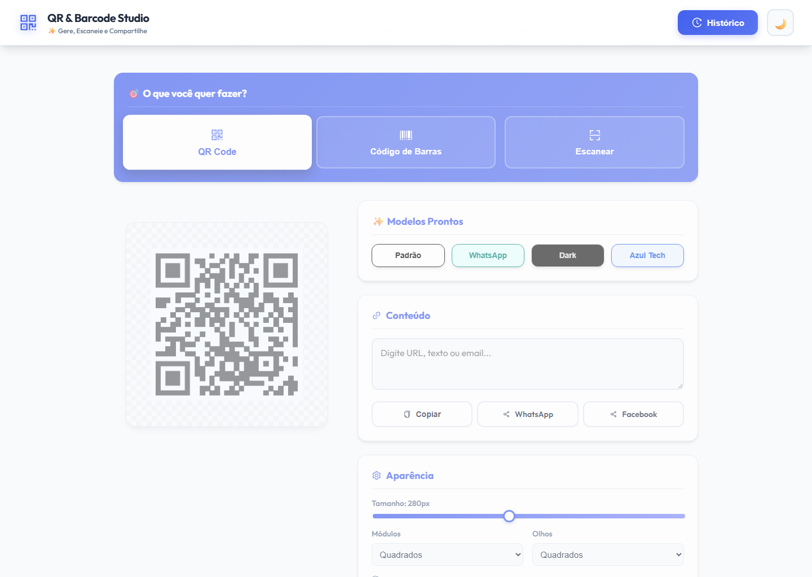

<div align="center">

# QR & Barcode Studio

A modern, fully client-side React app to **generate**, **customize**, and **scan** QR Codes and barcodes (25+ formats) — plus a dedicated reader that decodes Brazilian **NF-e / NFC-e** access keys. Live preview, light/dark themes, logo embedding, multi-format export, and a local history. No backend, no sign-up.

[](#license)
[](https://react.dev/)
[](https://qrcode.devfrs.com)
[](./CONTRIBUTING.md)

**[🌐 Live App — qrcode.devfrs.com](https://qrcode.devfrs.com)**



</div>

> **Note:** The interface is in Brazilian Portuguese (pt-BR); the target audience is Brazilian users. The codebase and documentation are in English.

## Table of Contents

- [Features](#features)
- [Getting Started](#getting-started)
- [Available Scripts](#available-scripts)
- [Deployment](#deployment)
- [Architecture](#architecture)
- [Tech Stack](#tech-stack)
- [Contributing](#contributing)
- [License](#license)

## Features

### QR Codes

- Full color customization (foreground and background)
- Module styles (squares or dots) and eye styles (square or rounded)
- Logo upload with adjustable size, opacity, and background removal
- Four error-correction levels (L, M, Q, H)
- Ready-made templates (Default, WhatsApp, Dark, Blue Tech)

### Barcodes (25+ formats)

| Family    | Formats                                          |
| --------- | ------------------------------------------------ |
| Code      | Code 39 · Code 93 · Code 128 (Auto, A, B, C)     |
| GS1 & ITF | GS1-128 · ITF · ITF-14                           |
| EAN/ISBN  | EAN-13 · EAN-8 · EAN-5 · EAN-2 · ISBN            |
| UPC       | UPC-A · UPC-E _(auto-expanded to UPC-A)_         |
| Other     | MSI (10, 11, 1010, 1110) · Pharmacode · Codabar  |

Every format has dedicated input validation with example values and inline error hints.

### Scanner & NF-e reader

- Read QR Codes and 1D barcodes (Code 128, Code 39, EAN, UPC, ITF, Codabar) using
  the **device camera** or by **uploading an image**
- Automatic recognition of Brazilian electronic invoices (**NF-e / NFC-e**, and
  CT-e / MDF-e) from either the DANFE barcode or the NFC-e QR Code URL
- Decodes the 44-digit access key into its fields — issuing state, emission month,
  issuer CNPJ, document model, series, and number — and validates its check digit
  (modulo 11)
- One tap to copy the content, open a scanned link, jump to the official SEFAZ
  lookup portal, or turn the scanned value back into a QR Code / barcode

> Camera scanning requires a secure context (HTTPS or `localhost`) and the user's
> camera permission. Image upload works everywhere.

### General

- Export to **PNG**, **WEBP**, **PDF**, and **SVG** (SVG for barcodes), with an optional transparent background
- Copy the generated image straight to the clipboard
- Light / dark theme
- Local generation history (stored in `localStorage`)
- Social sharing (WhatsApp, Facebook)
- Responsive, mobile-first layout · installable PWA

## Getting Started

**Prerequisites:** [Node.js 18.x](https://nodejs.org/)

```bash
git clone https://github.com/Franklyn-R-Silva/barcode-qr-generator.git
cd barcode-qr-generator
npm install
npm start
```

The app will be available at [http://localhost:3000](http://localhost:3000).

## Available Scripts

| Command         | Description                          |
| --------------- | ------------------------------------ |
| `npm start`     | Start the development server         |
| `npm run build` | Create an optimized production build |
| `npm test`      | Run the test suite (Jest + RTL)      |

## Deployment

The app is hosted on **Cloudflare Pages** under the custom domain
**[qrcode.devfrs.com](https://qrcode.devfrs.com)**. It is a fully static build —
there is no server-side component.

Cloudflare rebuilds on every push to `main`. The static `build/` output is
uploaded as Cloudflare Workers static assets via `wrangler.jsonc` (the deploy step
runs `npx wrangler deploy`).

| Setting                | Value           |
| ---------------------- | --------------- |
| Build command          | `npm run build` |
| Deploy command         | `npx wrangler deploy` |
| Build output directory | `build` (also set in `wrangler.jsonc` → `assets.directory`) |
| Node version           | `20` (pinned via `.nvmrc`; Wrangler 4 requires Node ≥ 20) |

`wrangler.jsonc` configures a static-assets-only Worker (no server code) with SPA
fallback. The custom domain and DNS are managed in the Cloudflare dashboard, so no
`homepage` field or `CNAME` file is required — assets load from the domain root.

## Architecture

Create React App (React 18), running entirely in the browser. A single `config`
state object in `App.jsx` drives both generators and the scanner, and flows down
to the preview, control, and scanner components.

```
src/
├── components/
│   ├── layout/      # Header, Footer
│   ├── common/      # Toast
│   ├── generator/   # QRCodePreview, BarcodePreview, Controls, ModeSelector,
│   │                # ExportOptions, ColorPickerAdvanced, History*
│   └── scanner/     # ScannerPanel (camera + image reader, NF-e details)
├── constants/       # Generator/mode types & barcode format definitions
└── utils/           # Barcode validators, NF-e access-key parser
```

QR codes render to a `<canvas>` (via `react-qrcode-logo`), barcodes to an `<svg>`
(via `react-barcode`/JsBarcode), and the scanner uses `html5-qrcode`; export logic
adapts to each path. See [ARCHITECTURE.md](./ARCHITECTURE.md) for the full picture.

## Tech Stack

- **React 18** (Create React App)
- **react-qrcode-logo** — QR rendering
- **react-barcode** / **JsBarcode** — barcode rendering
- **html5-qrcode** — camera & image scanning
- **framer-motion** — animations
- **react-colorful** — color picker
- **jsPDF** — PDF export
- **react-icons** — icons

## Contributing

Contributions are welcome! Please read **[CONTRIBUTING.md](./CONTRIBUTING.md)**
for the development setup, branch/commit conventions, and code style. In short:
fork → branch from `main` → make a focused change → verify `npm run build` →
open a PR using [Conventional Commits](https://www.conventionalcommits.org/).

## License

Released under the [MIT License](https://opensource.org/licenses/MIT).

## Author

**Franklyn Silva** — [GitHub](https://github.com/Franklyn-R-Silva) · [LinkedIn](https://www.linkedin.com/in/franklyn-roberto-dev/)
